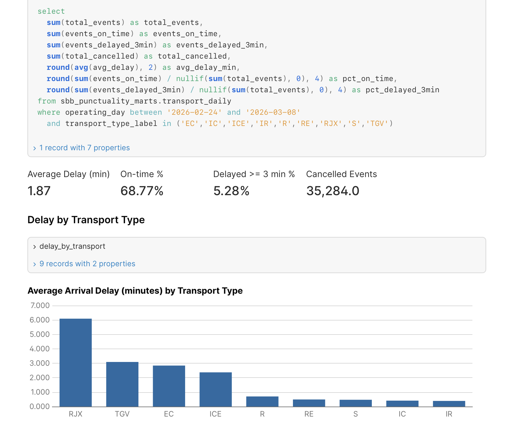
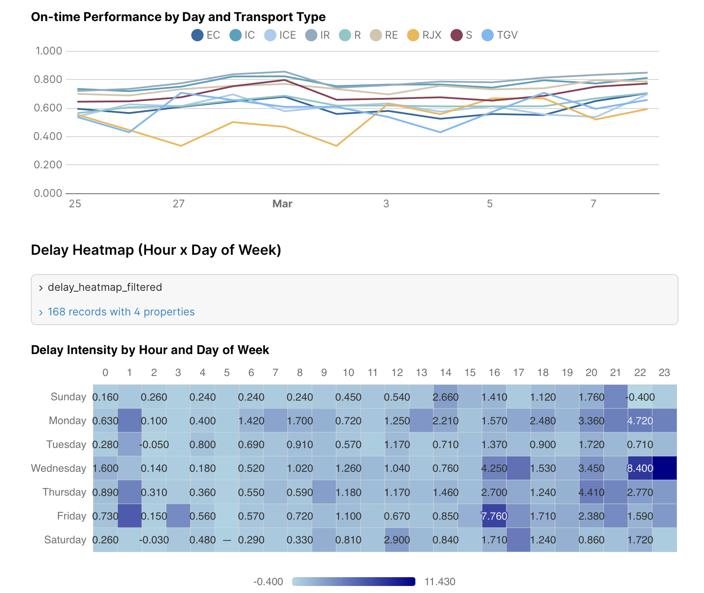
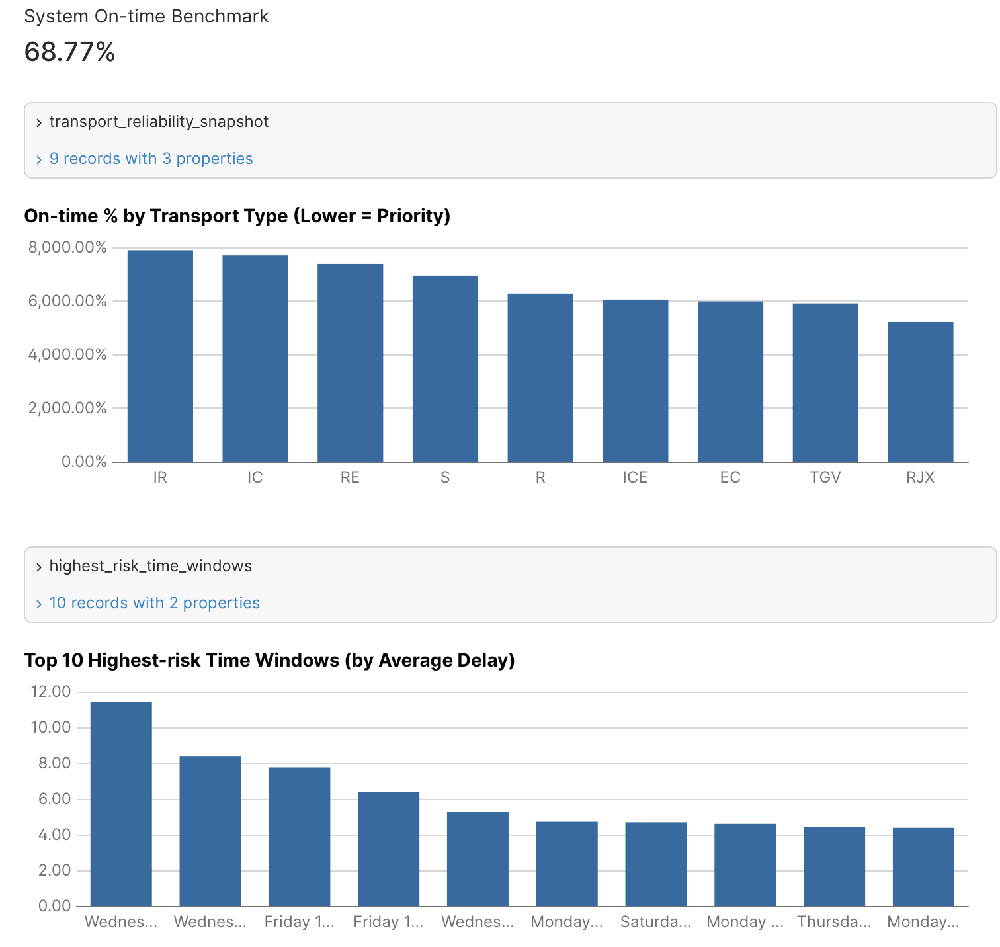

# Swiss Rail Punctuality Pipeline

**End-to-end data engineering pipeline analysing Swiss Federal Railways (SBB/CFF) punctuality data — from raw CSV ingestion to interactive dashboard.**


---

## Problem Statement

Switzerland's rail network publishes daily stop-level arrival data for every train, bus, and tram. This dataset contains millions of records per month, making manual analysis impractical. This project builds a fully automated pipeline that ingests, transforms, and visualises punctuality metrics — enabling transport analysts (or curious commuters) to answer: *which lines and stations are chronically late, and when do delays peak?*

## Dashboard Preview

### KPI Cards & Delay by Transport Type


### On-Time Trends Over Time


### Benchmark, Reliability & Risk Windows


## Architecture

```
┌──────────────┐     ┌──────────────┐     ┌──────────────┐     ┌──────────────┐
│  SBB Open    │     │   Google     │     │   BigQuery   │     │  Evidence    │
│  Data Portal │────>│ Cloud Storage│────>│  (raw + dbt) │────>│  Dashboard   │
│  (CSV)       │     │  (Parquet)   │     │              │     │              │
└──────────────┘     └──────────────┘     └──────────────┘     └──────────────┘
       │                    │                    │                     │
       └────── Airflow DAG: sbb_daily_ingest ───┘                     │
                            └──── Airflow DAG: sbb_dbt_transform ─────┘

Infra provisioned by Terraform (GCS bucket, BigQuery dataset, service account)
```

## Tech Stack

| Tool | Role |
|------|------|
| **Python 3.13 + uv** | Runtime & dependency management |
| **Terraform** | GCP infrastructure as code (GCS, BigQuery, IAM) |
| **Apache Airflow** | Orchestration — two DAGs (ingest + transform) |
| **Google Cloud Storage** | Raw data lake (Parquet files) |
| **BigQuery** | Data warehouse (partitioned + clustered) |
| **dbt-core** | SQL transformation (staging → intermediate → marts) |
| **Evidence** | BI dashboard (static site from BigQuery marts) |
| **marimo** | Data exploration notebook (Phase 2) |

## Data Model

Star schema built with dbt across four layers:

```
raw.ist_daten_raw          ← source CSV loaded as-is
  └─ staging.stg_stop_events    ← typed, renamed, deduplicated
       └─ intermediate.int_delays    ← delay computation + flags
            ├─ marts.fct_daily_delays      ← daily KPIs by transport type & line
            ├─ marts.fct_station_delays    ← daily KPIs by station
            ├─ marts.bi_transport_daily    ← dashboard-ready daily aggregates
            └─ marts.bi_delay_heatmap      ← hour × day-of-week delay matrix

Dimensions: dim_stations · dim_operators · dim_transport_types
```

**Partitioning**: by `operating_day` (date) — all analytics filter by date range.
**Clustering**: by `transport_type` — co-locates IC/IR/RE/S/Bus queries.

## Project Structure

```
swiss-rail-punctuality/
├── airflow/
│   ├── dags/
│   │   ├── sbb_daily_ingest.py      # Raw CSV → Parquet → GCS → BigQuery
│   │   └── sbb_dbt_transform.py     # dbt deps + run + test
│   ├── docker-compose.yaml
│   ├── Dockerfile
│   └── .env.example
├── dbt_sbb_punctuality/
│   ├── models/
│   │   ├── sources/
│   │   ├── staging/
│   │   ├── intermediate/
│   │   └── marts/
│   ├── macros/
│   ├── seeds/
│   ├── tests/
│   ├── dbt_project.yml
│   └── profiles.yml
├── evidence/
│   ├── pages/index.md                # Dashboard definition
│   └── evidence.config.yaml
├── terraform/
│   ├── main.tf
│   ├── variables.tf
│   ├── outputs.tf
│   └── terraform.tfvars.example
├── notebooks/
│   └── exploration.py                # marimo data profiling
├── src/swiss_rail_punctuality/
│   └── profiling.py
├── images/                           # Dashboard screenshots
├── pyproject.toml
└── uv.lock
```

## Getting Started

### Prerequisites

- Python 3.13 with [`uv`](https://docs.astral.sh/uv/)
- Terraform >= 1.5
- Docker & Docker Compose
- GCP account with billing enabled
- `gcloud` CLI authenticated (`gcloud auth application-default login`)

### 1. Clone & install

```bash
git clone https://github.com/<your-username>/swiss-rail-punctuality.git
cd swiss-rail-punctuality
uv sync --all-groups
```

### 2. Provision infrastructure (Terraform)

```bash
cp terraform/terraform.tfvars.example terraform/terraform.tfvars
# Edit terraform.tfvars: set project_id and bucket_suffix
terraform -chdir=terraform init
terraform -chdir=terraform apply
```

This creates: 1 GCS bucket, 1 BigQuery dataset, 1 service account.

### 3. Configure Airflow

```bash
cp airflow/.env.example airflow/.env
# Fill in: GCP_PROJECT_ID, RAW_BUCKET, BQ_DATASET, BQ_TABLE, INGEST_START_DATE
```

Create a service account key for local Airflow:

```bash
gcloud iam service-accounts keys create airflow/credentials/gcp-key.json \
  --iam-account "$(terraform -chdir=terraform output -raw service_account_email)"
```

### 4. Start Airflow & run ingestion

```bash
docker compose --env-file airflow/.env -f airflow/docker-compose.yaml build
docker compose --env-file airflow/.env -f airflow/docker-compose.yaml up airflow-init
docker compose --env-file airflow/.env -f airflow/docker-compose.yaml up -d
```

Open [http://localhost:8080](http://localhost:8080) (admin / admin). Unpause both DAGs and trigger `sbb_daily_ingest`:

```json
{ "mode": "latest", "backfill_days": 7 }
```

The ingest DAG automatically triggers the dbt transform DAG on success.

### 5. Run dbt manually (optional)

```bash
uv run dbt deps --project-dir dbt_sbb_punctuality --profiles-dir dbt_sbb_punctuality
uv run dbt run  --project-dir dbt_sbb_punctuality --profiles-dir dbt_sbb_punctuality
uv run dbt test --project-dir dbt_sbb_punctuality --profiles-dir dbt_sbb_punctuality
```

### 6. Launch the Evidence dashboard

```bash
cd evidence
npm install
npx evidence dev
```

Open [http://localhost:3000](http://localhost:3000) to view the interactive dashboard.

## Design Decisions

| Decision | Rationale |
|----------|-----------|
| **Parquet over raw CSV in GCS** | ~10x compression, columnar reads, schema enforcement at ingest |
| **Partition by date + cluster by transport type** | Matches query patterns — all analytics filter by date window and often by transport type |
| **Layered dbt (staging → intermediate → marts)** | Separation of concerns: parsing/typing, business logic, consumption-ready aggregates |
| **Two Airflow DAGs** | Decouples ingestion from transformation — each can be retried independently |
| **Evidence over Metabase/Superset** | Lightweight, code-as-config, deploys as static site — ideal for a portfolio project |
| **Deterministic Docker image** | `uv.lock` pinned in build — no runtime `pip install`, reproducible across environments |

## Known Limitations & Future Work

- **No streaming**: pipeline runs on a daily batch schedule; near-real-time would require Pub/Sub + Dataflow
- **Single-region**: infrastructure is `europe-west6` only; multi-region not needed at this scale
- **No CI/CD**: dbt tests run in Airflow but there is no GitHub Actions pipeline yet
- **No Soda integration**: data quality relies on dbt tests; Soda could add cross-system checks
- **Dashboard hosting**: Evidence runs locally; production deployment would use Vercel/Netlify or GCS static hosting

## Acknowledgments

- [DataTalksClub DE Zoomcamp](https://github.com/DataTalksClub/data-engineering-zoomcamp) — course structure and project framework
- [SBB Open Data](https://opentransportdata.swiss/) — source dataset (Ist-Daten / actual arrivals)
- Built with Terraform, Apache Airflow, dbt, BigQuery, and Evidence
