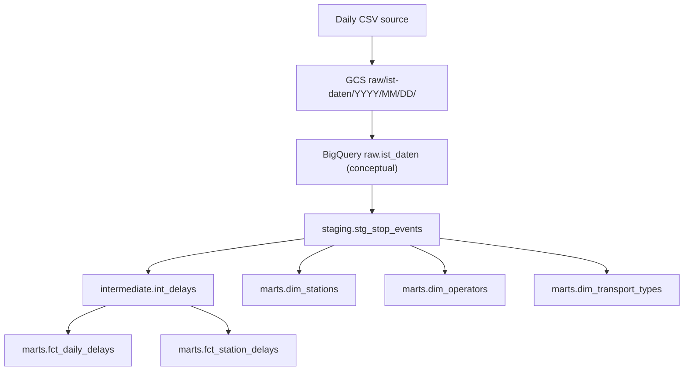

## Swiss Rail Punctuality - Phase 1

Phase 1 sets up the local developer environment and provisions base GCP infrastructure:

- 1 raw GCS bucket
- 1 BigQuery dataset
- 1 service account for pipeline workloads

## Prerequisites

- Python 3.13
- `uv`
- Terraform >= 1.5
- Authenticated GCP CLI (`gcloud auth application-default login`)

## Local Setup (uv)

Install dependencies (including dev tools):

```bash
uv sync --all-groups
```

Run the app:

```bash
uv run python main.py
```

## Phase 2: Data Exploration with marimo

Phase 2 replaces Jupyter with a reproducible `marimo` notebook script:
- `notebooks/exploration.py`
- reusable helpers in `src/swiss_rail_punctuality/profiling.py`

### 1) Add a local sample file

Put one small file under `data/raw/sample/`:
- `ist_daten_sample.csv` (semicolon-separated)
- or `ist_daten_sample.parquet`

The app validates required columns:
`BETRIEBSTAG`, `VERKEHRSMITTEL_TEXT`, `AN_PROGNOSE_STATUS`, `ANKUNFTSZEIT`, `AN_PROGNOSE`, `FAELLT_AUS_TF`.

### 2) Launch the marimo app

```bash
uv run marimo edit notebooks/exploration.py
```

Or run in read mode:

```bash
uv run marimo run notebooks/exploration.py
```

### 3) What Phase 2 produces

- Row counts, column types, and null-rate table
- Value distributions for `VERKEHRSMITTEL_TEXT` and `AN_PROGNOSE_STATUS`
- Delay validation: `delay_min = AN_PROGNOSE - ANKUNFTSZEIT` in minutes
- Edge-case slices for null arrivals, non-`REAL`/`ESTIMATED` statuses, and cancellations
- A short decision log you can reuse in interviews/README

## Phase 3: Raw Ingestion Pipeline (Airflow)

Phase 3 adds an orchestrated raw ingestion DAG that runs daily:

1. `download_csv` for the target execution date
2. `convert_to_parquet`
3. `upload_to_gcs` under `raw/ist-daten/YYYY/MM/DD/`
4. `load_to_bigquery` into a partitioned raw table
5. `cleanup_local`

### Files added for Phase 3

- `airflow/docker-compose.yaml`
- `airflow/requirements.txt`
- `airflow/.env.example`
- `airflow/dags/sbb_daily_ingest.py`

### 1) Prepare environment variables

From repo root:

```bash
cp airflow/.env.example airflow/.env
```

Update `airflow/.env` with values from Terraform outputs:

```bash
terraform -chdir=terraform output -raw raw_bucket_name
terraform -chdir=terraform output -raw bigquery_dataset_id
terraform -chdir=terraform output -raw service_account_email
```

Set at least:
- `GCP_PROJECT_ID`
- `RAW_BUCKET`
- `BQ_DATASET`
- `BQ_TABLE`
- `INGEST_START_DATE` (for catchup window)

### 2) Add service account key for local Airflow

Create a key if needed:

```bash
gcloud iam service-accounts keys create airflow/credentials/gcp-key.json \
  --iam-account "$(terraform -chdir=terraform output -raw service_account_email)"
```

### 3) Start Airflow

```bash
docker compose --env-file airflow/.env -f airflow/docker-compose.yaml build
docker compose --env-file airflow/.env -f airflow/docker-compose.yaml up airflow-init
docker compose --env-file airflow/.env -f airflow/docker-compose.yaml up -d
```

This project uses a deterministic Airflow image build (`airflow/Dockerfile`) with dependencies resolved from `uv.lock`.  
No runtime `pip install` runs during container startup.

To stop Airflow:

```bash
docker compose --env-file airflow/.env -f airflow/docker-compose.yaml down
```

If you also want to remove local volumes (reset local Airflow state):

```bash
docker compose --env-file airflow/.env -f airflow/docker-compose.yaml down -v
```

Open Airflow at [http://localhost:8080](http://localhost:8080) with:
- user: `admin`
- password: `admin`

### 4) Run and verify Phase 3

Trigger one run in UI for `sbb_daily_ingest` (or run a backfill/catchup window using `INGEST_START_DATE`).

By default (scheduled or manual run), the DAG ingests the **latest available day** published on the source page.

Before a manual run, open **Trigger DAG**:
- In newer Airflow UI you should now see parameter fields (`mode`, `run_date`, `backfill_days`) directly.
- You can also still use the config JSON.

Config JSON example:

```json
{
  "mode": "latest",
  "backfill_days": 1
}
```

Manual options:
- `mode: "latest"` -> anchor on the latest published day.
- `mode: "date"` -> anchor on a specific day using `run_date`.
- `mode: "resume"` -> load source dates after the latest loaded `betriebstag_date` in raw BigQuery.
- `backfill_days` -> integer from `1` to `7` (includes anchor day and previous available days).

Example: run latest + previous 6 days (7 total):

```json
{
  "mode": "latest",
  "backfill_days": 7
}
```

Example: run from specific anchor date + previous 2 available days:

```json
{
  "mode": "date",
  "run_date": "2026-03-01",
  "backfill_days": 3
}
```

Example: resume from the last loaded raw partition:

```json
{
  "mode": "resume"
}
```

Validate outputs:
- GCS object path exists: `gs://<RAW_BUCKET>/raw/ist-daten/YYYY/MM/DD/`
- BigQuery raw table exists and is populated for that date:

```sql
SELECT betriebstag_date, COUNT(*) AS rows_loaded
FROM `your-project.your_dataset.ist_daten_raw`
GROUP BY betriebstag_date
ORDER BY betriebstag_date DESC
LIMIT 10;
```

### Data quality scope in Phase 3

Phase 3 keeps quality checks lightweight (required columns, non-empty files, load success).  
Formal model-level quality remains in the dbt phases (Phase 5-6). Soda is intentionally deferred as an optional extra-mile addition after the core pipeline is stable.
The raw layer intentionally preserves upstream imperfections; strict semantic guarantees are enforced from staging/intermediate onward.

## Phase 4: Data Storage Design

Phase 4 defines a warehouse layer contract that is both query-efficient and easy to explain in interviews.

### Storage layer architecture



### Layer contracts (current)

- `raw.ist_daten` (conceptual): direct ingestion output, closest representation of source data.
- `staging.stg_stop_events`: typed, renamed, and deduplicated stop-event records.
- `intermediate.int_delays`: standardized delay metrics and delay flags.
- `marts.fct_daily_delays` and `marts.fct_station_delays`: analysis-ready facts.
- `marts.dim_stations`, `marts.dim_operators`, `marts.dim_transport_types`: stable dimension lookups.

### Current implementation mapping

Current Phase 3 implementation uses:

- Table: `sbb_punctuality.ist_daten_raw`
- Partition key: `betriebstag_date` (normalized from source field `BETRIEBSTAG`)
- Cluster key: `VERKEHRSMITTEL_TEXT`

This maps to the conceptual `raw.ist_daten` layer used in the design and documentation.

### Partitioning and clustering rationale

- Partition by operating date (`BETRIEBSTAG` -> `betriebstag_date`) because nearly all analytics filter by date windows.
- Clustering by `VERKEHRSMITTEL_TEXT` co-locates transport-type records (IC, IR, RE, S, Bus) frequently queried together.
- Combined partition + cluster design reduces scanned bytes and improves query cost/performance for dashboard and ad hoc analysis.
- Keeping the raw layer append-idempotent and transformation layers declarative (dbt) improves reproducibility and operational safety.

### Portfolio interview narrative (2 sentences)

This warehouse is designed as a layered contract: raw ingestion preserves source fidelity, while downstream dbt layers progressively enforce business logic and analytics semantics.  
Partitioning by operating day and clustering by transport type is a deliberate cost/performance decision that mirrors real production usage patterns for punctuality analytics.

## Phase 5: Data Transformation (dbt)

Phase 5 adds a production-grade dbt project for transformation logic and core quality checks:

- project root: `dbt_sbb_punctuality/`
- layers: `staging -> intermediate -> marts`
- reusable parsing macro for Swiss timestamps
- schema + custom dbt tests for core model correctness

### Files added in Phase 5

- `dbt_sbb_punctuality/dbt_project.yml`
- `dbt_sbb_punctuality/profiles.yml`
- `dbt_sbb_punctuality/packages.yml`
- `dbt_sbb_punctuality/models/sources/_sources.yml`
- `dbt_sbb_punctuality/models/staging/stg_stop_events.sql`
- `dbt_sbb_punctuality/models/staging/_stg_models.yml`
- `dbt_sbb_punctuality/models/intermediate/int_delays.sql`
- `dbt_sbb_punctuality/models/intermediate/_int_models.yml`
- `dbt_sbb_punctuality/models/marts/fct_daily_delays.sql`
- `dbt_sbb_punctuality/models/marts/fct_station_delays.sql`
- `dbt_sbb_punctuality/models/marts/dim_stations.sql`
- `dbt_sbb_punctuality/models/marts/dim_operators.sql`
- `dbt_sbb_punctuality/models/marts/dim_transport_types.sql`
- `dbt_sbb_punctuality/models/marts/_marts_models.yml`
- `dbt_sbb_punctuality/macros/parse_swiss_timestamp.sql`
- `dbt_sbb_punctuality/tests/assert_delay_reasonable.sql`

### Model contracts

- `stg_stop_events`: parses Swiss timestamps, renames raw columns to English `snake_case`, filters pass-throughs and cancellations, and deduplicates stop events.
- `int_delays`: computes:
  - `arrival_delay_min = TIMESTAMP_DIFF(actual_arrival_ts, scheduled_arrival_ts, MINUTE)`
  - `is_delayed = arrival_delay_min > 0`
  - `is_significantly_delayed = arrival_delay_min >= 3`
  - keeps only `REAL` and `ESTIMATED` arrival statuses
- `fct_daily_delays`: daily KPIs by day x transport type x line:
  - `avg_delay`
  - `pct_on_time`
  - `pct_delayed_3min`
  - `total_cancelled`
- `fct_station_delays`: same KPI family at station x day grain.
- dimensions are deduplicated lookups from staging.

### Core tests in Phase 5

Phase 5 includes only **core** tests needed to guarantee trustworthy marts:

- source and schema tests (`not_null`, `accepted_values`, uniqueness checks), with null-heavy raw fields allowed to warn instead of fail
- package test via `dbt_utils` for composite uniqueness
- custom test `assert_delay_reasonable` on delay bounds (`-60` to `+180` min)

Broader test expansion is intentionally deferred to **Phase 6**.

### Premium test expansion in Phase 6

Phase 6 upgrades quality to a portfolio-grade test suite with layered checks:

- `dbt_utils` composite uniqueness at staging/intermediate/marts grain
- `dbt_expectations` KPI guardrails:
  - percentages stay in `0..100`
  - count metrics stay `>= 0`
  - delay values stay within operational bounds
- relationships integrity:
  - `fct_station_delays.station_uic -> dim_stations.station_uic`
  - `fct_daily_delays.transport_type -> dim_transport_types.transport_type`
- source freshness SLA on `raw.ist_daten_raw` (`warn_after: 36h`, `error_after: 60h`)
- domain-specific singular test: `tests/assert_delay_reasonable.sql`

### Run Phase 5 + Phase 6 locally

1. Install dependencies:

```bash
uv sync --all-groups
```

2. Ensure env vars are available:

- `GCP_PROJECT_ID`
- `BQ_DATASET` (default `sbb_punctuality`)
- optional `GCP_REGION` (default `europe-west6`)

Auth options:
- local/dev: `gcloud auth application-default login` (used by `method: oauth`)
- service-account key (optional): export `GOOGLE_APPLICATION_CREDENTIALS` if you switch profile auth method

3. Install dbt package dependencies:

```bash
uv run dbt deps --project-dir dbt_sbb_punctuality --profiles-dir dbt_sbb_punctuality
```

4. Build models:

```bash
uv run dbt run --project-dir dbt_sbb_punctuality --profiles-dir dbt_sbb_punctuality
```

5. Run tests:

```bash
uv run dbt test --project-dir dbt_sbb_punctuality --profiles-dir dbt_sbb_punctuality
```

6. Check source freshness:

```bash
uv run dbt source freshness --project-dir dbt_sbb_punctuality --profiles-dir dbt_sbb_punctuality
```

### Quick verification queries

```sql
SELECT operating_day, transport_type, line_name, avg_delay, pct_on_time, pct_delayed_3min, total_cancelled
FROM `your-project.your_dataset.fct_daily_delays`
ORDER BY operating_day DESC
LIMIT 20;
```

```sql
SELECT operating_day, station_name, avg_delay, pct_on_time, total_cancelled
FROM `your-project.your_dataset.fct_station_delays`
ORDER BY operating_day DESC
LIMIT 20;
```

## Phase 7: Orchestration & Scheduling

Phase 7 upgrades orchestration to a two-DAG Airflow pipeline with explicit contracts:

- `sbb_daily_ingest` (scheduled at `06:00 UTC`) handles raw ingestion from source CSV to BigQuery raw.
- `sbb_dbt_transform` (triggered) runs `dbt deps`, `dbt run`, and `dbt test`.
- Ingest DAG triggers transform DAG only on successful ingestion completion.

### Files added/updated in Phase 7

- `airflow/dags/sbb_daily_ingest.py` (selection modes + trigger to dbt DAG)
- `airflow/dags/sbb_dbt_transform.py` (dbt orchestration DAG)
- `airflow/Dockerfile` (deterministic Airflow runtime with `uv` + `uv.lock`)
- `airflow/docker-compose.yaml` (mount dbt project into Airflow containers)

### Trigger behavior

- Scheduled daily run: `sbb_daily_ingest` executes at `0 6 * * *`.
- Manual run modes:
  - `latest`: latest published day (plus optional `backfill_days`)
  - `date`: anchor on explicit `run_date` and apply `backfill_days`
  - `resume`: process dates newer than latest loaded raw partition
- Post-ingest trigger: `sbb_daily_ingest` triggers `sbb_dbt_transform` with run metadata in `dag_run.conf`.

### How to test Phase 7 end-to-end

1. Restart Airflow services so new DAGs/dependencies are loaded:

```bash
docker compose --env-file airflow/.env -f airflow/docker-compose.yaml down
docker compose --env-file airflow/.env -f airflow/docker-compose.yaml build
docker compose --env-file airflow/.env -f airflow/docker-compose.yaml up airflow-init
docker compose --env-file airflow/.env -f airflow/docker-compose.yaml up -d
```

2. In Airflow UI, unpause:
- `sbb_daily_ingest`
- `sbb_dbt_transform`

3. Trigger ingestion DAG with one of these payloads:

Latest day:
```json
{
  "mode": "latest",
  "backfill_days": 1
}
```

Specific day window:
```json
{
  "mode": "date",
  "run_date": "2026-03-01",
  "backfill_days": 3
}
```

Resume mode:
```json
{
  "mode": "resume"
}
```

4. Verify orchestration in Airflow:
- `sbb_daily_ingest` succeeds end-to-end.
- `trigger_dbt_transform` task runs.
- `sbb_dbt_transform` starts automatically and all three tasks pass (`dbt_deps`, `dbt_run`, `dbt_test`).
- Commands now run via plain dbt CLI from the prebuilt image (no fallback command needed).

5. Validate raw partitions after ingest:

```sql
SELECT betriebstag_date, COUNT(*) AS rows_loaded
FROM `your-project.your_dataset.ist_daten_raw`
GROUP BY betriebstag_date
ORDER BY betriebstag_date DESC
LIMIT 20;
```

6. Validate marts after dbt DAG:

```sql
SELECT operating_day, transport_type, avg_delay, pct_on_time, pct_delayed_3min
FROM `your-project.your_dataset.fct_daily_delays`
ORDER BY operating_day DESC
LIMIT 20;
```

### Relaunch strategy (no 30-day backfill)

For relaunch after downtime, use either:
- `mode=resume` to ingest only dates newer than the latest loaded raw partition, or
- `mode=date` with `backfill_days` to replay a specific controlled window.

If dbt command resolution is ever in doubt, verify inside scheduler:

```bash
docker compose --env-file airflow/.env -f airflow/docker-compose.yaml exec airflow-scheduler dbt --version
```

## Linters

Python linting with Ruff:

```bash
uv run ruff check .
```

SQL linting with SQLFluff (dbt templater + BigQuery dialect):

```bash
GCP_PROJECT_ID=your-project uv run sqlfluff lint dbt_sbb_punctuality/models dbt_sbb_punctuality/tests
```

## Terraform (Phase 1 Infrastructure)

1. Copy the example variables file:

```bash
cp terraform/terraform.tfvars.example terraform/terraform.tfvars
```

2. Edit `terraform/terraform.tfvars` and set:
- `project_id`
- `bucket_suffix` (must make the bucket name globally unique)
- optionally keep `region = "europe-west6"` and `dataset_id = "sbb_punctuality"`

3. Initialize, validate, and plan:

```bash
terraform -chdir=terraform init
terraform -chdir=terraform fmt -recursive
terraform -chdir=terraform validate
terraform -chdir=terraform plan
```

4. Apply when ready:

```bash
terraform -chdir=terraform apply
```

## Optional: Generate a Service Account Key (Local Development)

If you need a JSON key locally for tools that cannot use ADC:

```bash
gcloud iam service-accounts keys create sbb-punctuality-sa-key.json \
  --iam-account "$(terraform -chdir=terraform output -raw service_account_email)"
```

The repository ignores `*.json` and `*.tfvars` to avoid leaking credentials.
